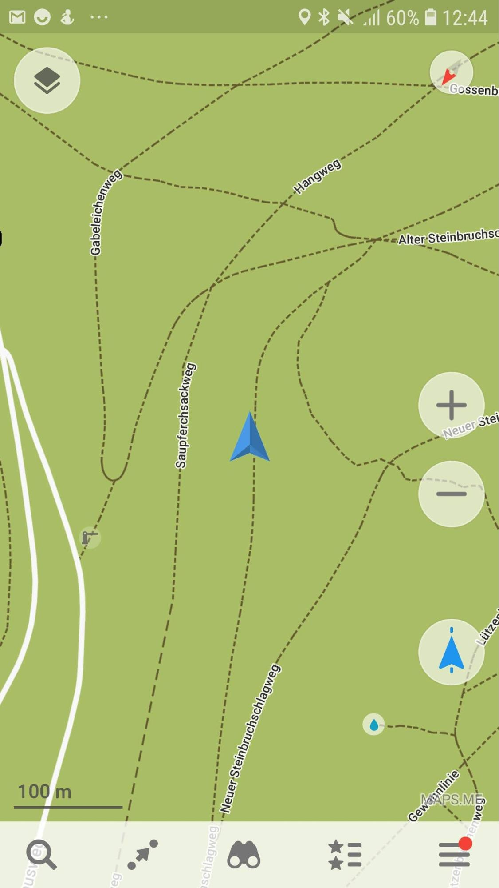

# MapsForAll
Push maps on devices that do not support them -> create bitmap tiles or continous GPX.
<!-- Output copied to clipboard! -->

<!-----
NEW: Check the "Suppress top comment" option to remove this info from the output.

Conversion time: 1.941 seconds.

Using this Markdown file:

1. Paste this output into your source file.
2. See the notes and action items below regarding this conversion run.
3. Check the rendered output (headings, lists, code blocks, tables) for proper
   formatting and use a linkchecker before you publish this page.

Conversion notes:

* Docs to Markdown version 1.0β31
* Sun Jan 02 2022 07:03:24 GMT-0800 (PST)
* Source doc: Maps for all
* This document has images: check for >>>>>  gd2md-html alert:  inline image link in generated source and store images to your server. NOTE: Images in exported zip file from Google Docs may not appear in  the same order as they do in your doc. Please check the images!

----->

>>>>>  gd2md-html alert:  ERRORs: 0; WARNINGs: 0; ALERTS: 7.

<ul style="color: red; font-weight: bold"><li>See top comment block for details on ERRORs and WARNINGs. <li>In the converted Markdown or HTML, search for inline alerts that start with >>>>>  gd2md-html alert:  for specific instances that need correction.</ul>

Links to alert messages:
<a href="#gdcalert1">alert1</a>
<a href="#gdcalert2">alert2</a>
<a href="#gdcalert3">alert3</a>
<a href="#gdcalert4">alert4</a>
<a href="#gdcalert5">alert5</a>
<a href="#gdcalert6">alert6</a>
<a href="#gdcalert7">alert7</a>

>>>>> PLEASE check and correct alert issues and delete this message and the inline alerts.

The goal of this project was to bring maps to devices not supporting them, such as the Suunto Sport.

>>>>>  gd2md-html alert: inline image link here (to images/image1.jpg). Store image on your image server and adjust path/filename/extension if necessary.  (<a href="#">Back to top</a>)(<a href="#gdcalert2">Next alert</a>) >>>>> 

>>>>>  gd2md-html alert: inline image link here (to images/image2.jpg). Store image on your image server and adjust path/filename/extension if necessary.  (<a href="#">Back to top</a>)(<a href="#gdcalert3">Next alert</a>) >>>>> 

I have worked on that for quite a while, bought the Fenix 3 to do prototyping, got a prototype running on it using raster map (the user SDK of Garmin is actually very bad with vector data (for some good reasons, not attacking Garmin on that)). The creation part is also somewhere in this project (but not part of the graphical tool).

>>>>>  gd2md-html alert: inline image link here (to images/image3.jpg). Store image on your image server and adjust path/filename/extension if necessary.  (<a href="#">Back to top</a>)(<a href="#gdcalert4">Next alert</a>) >>>>> 

Call me stubborn, I went back to the drawing board, and thought more of having a map on a watch. Also bought an old Oregon 300 for seeing how Garmin does map. And came to the conclusion that we do not need an actual map on a watch, as the screen is way too small, but ony the paths. Actually with a defined route, only the starts of the other paths are needed, to know which direction to go. It’s especially useful in places like forest, when most intersection are with a very small angle. Only with the route I don’t know if I should go left or right, with the drawing on the other path I can.

So what I did is 

* to propose a tool where the user can select which part of a map he would like to have, so only ways, but could be points of the ways, segments or the full way (but all need to be contiguous for being used as a route :( ),
* and to use a deep search algorithm to “walk” on all selected part of paths on a map, in order to create a route that represent a map:

>>>>>  gd2md-html alert: inline image link here (to images/image4.jpg). Store image on your image server and adjust path/filename/extension if necessary.  (<a href="#">Back to top</a>)(<a href="#gdcalert5">Next alert</a>) >>>>> 

It’s called the Route inspection problem, but I addressed it as a computer scientist. Still my algorithm works quite well, and is fast enough to iterate hundreds of time (400 currently, but might be too much), with random choice of direction at each intersection. The paths and intersections are marked as to not go back too many time to an used path (still sometime it is the best solution). At the end only the 10 best solutions are kept:

>>>>>  gd2md-html alert: inline image link here (to images/image5.jpg). Store image on your image server and adjust path/filename/extension if necessary.  (<a href="#">Back to top</a>)(<a href="#gdcalert6">Next alert</a>) >>>>> 

The final number of points is around 2 to 3 time what is initially for this selection. Of course it is a little bit stupid to do that, when the watch could simply “reuse” the code to print the route, and support detached segments.

The next part is actually useful in any way: there the solution can be simplified. My decimation is “smart” in a simple way: it does not touch intersections and, due to the coming several time on the same path, remove always all points at a node (i.e. if a path has been used 4 time, the decimation will always remove the same points for the 4 passages). It removes points based on the angle of the way at the point (remove if less than X), and iterate on the decimation, with the possibility to increase the angle (so next time it will remove more curved parts) :

>>>>>  gd2md-html alert: inline image link here (to images/image6.jpg). Store image on your image server and adjust path/filename/extension if necessary.  (<a href="#">Back to top</a>)(<a href="#gdcalert7">Next alert</a>) >>>>> 

>>>>>  gd2md-html alert: inline image link here (to images/image7.jpg). Store image on your image server and adjust path/filename/extension if necessary.  (<a href="#">Back to top</a>)(<a href="#gdcalert8">Next alert</a>) >>>>> 

